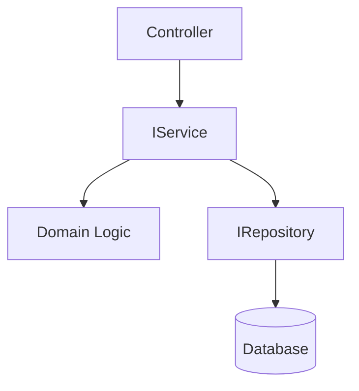

# Specification: <Feature Name>

**Document:** `docs/decisions/<feature-branch-name>/spec.md`
**Status:** Draft | Ready for Review | Approved
**Branch:** `<feature/ | fix/ | refactor/...>`
**PR:** `<PR number or TBD>`
**Phase:** `<phase number and name>`
**Depends on:** `<spec name or "None">`
**Author:** `<name>`
**Date:** `<YYYY-MM-DD>`

---

## Table of Contents

- [User Story](#user-story)
- [Background and Goals](#background-and-goals)
- [Design Decisions](#design-decisions)
- [Architecture Overview](#architecture-overview)
- [Scope](#scope)
- [Acceptance Criteria](#acceptance-criteria)
- [File Layout](#file-layout)
- [Technical Notes](#technical-notes)
- [Out of Scope](#out-of-scope)
- [Learning Opportunities](#learning-opportunities)
- [DX / Tooling Idea](#dx--tooling-idea)
- [Definition of Done](#definition-of-done)

---

## User Story

> As a [user type], I want [goal] so that [value delivered].

[Optional: 1–2 sentences expanding on the user story if the one-liner leaves
context on the table. The story should make the reader care about the problem
before the solution is described.]

---

## Background and Goals

[Explain the problem this feature solves. Not what you're building — why you're
building it. A reader who has never seen this codebase should understand the
problem clearly by the end of this section.]

[Structure this around the problems that exist today, not the solution. If there
are multiple root causes, name them. If there is a consequence to not fixing this,
state it.]

### Goals

* [Goal 1 — a measurable or observable outcome, not a task]
* [Goal 2]
* [Goal 3]

### Non-Goals

* [What this spec explicitly does not attempt to solve]
* [Adjacent problems that might seem related but are out of scope]

---

## Design Decisions

> This is the most important section in the spec. Document the *why* behind
> every non-obvious choice. A future maintainer will ask "why did we do it this
> way?" — answer that question here, before they have to ask.

### Why [Approach A] instead of [Approach B]?

[Explain the tradeoff. What does Approach A give you that B does not? What does
it cost? What assumptions does this decision make about the system?]

> **Example:** Why custom exception types instead of a result pattern?
> Named exceptions are explicit and self-documenting. Adding a new failure mode
> means adding a new class — the middleware never changes. This follows Open/Closed:
> open for extension, closed for modification. A result pattern would require
> callers to inspect a discriminated union, adding noise to every call site.

---

### Why [Decision 2]?

[Same pattern — state what was decided and the reasoning.]

---

### Why [Decision 3]?

[Same pattern. Include at least three design decisions for any non-trivial feature.
If you cannot articulate three decisions, the design probably has implicit
assumptions that should be made explicit.]

---

## Architecture Overview

> **Recommended for non-trivial features.** Include a diagram when the
> feature introduces new components, crosses layer boundaries in a non-obvious
> way, or modifies an existing flow. Omit for straightforward CRUD additions.

### C4 Component Diagram (if applicable)



### Flow summary (if no diagram)

[Describe the data flow for this feature in plain text. Who calls what, in what
order, with what inputs and outputs? This does not need to replace the full request
flow in `architecture.md` — just the parts that are new or changed by this feature.]

---

## Scope

> List every file this spec will create or modify. This table is the contract
> between the spec and the implementation. If a file is not listed here, the
> engineer should question whether the spec is complete.

| # | Action | File |
|---|---|---|
| 1 | Create | `<Layer>/<Subfolder>/<FileName>.cs` |
| 2 | Create | `<Layer>/<Subfolder>/<FileName>.cs` |
| 3 | Modify | `<Layer>/<Subfolder>/<FileName>.cs` |
| 4 | Modify | `<Layer>/DependencyInjection.cs` |

---

## Acceptance Criteria

> Acceptance criteria define **behavioral correctness** — what the system must
> do for this feature to work correctly. These are observable outcomes, not tasks.
> Each AC should be independently verifiable.
>
> Use the format: **Given** [state], **when** [action], **then** [outcome].
> Or use a declarative format when the behavior is straightforward.

### AC-1: [Behavior Name]

[Describe the observable behavior. Be specific about inputs, expected outputs,
and any preconditions. If this AC has a corresponding code contract, state it.]

**Rules:**
- [Specific rule or constraint for this AC]
- [Another rule]

---

### AC-2: [Behavior Name]

[Same pattern]

**Rules:**
- [...]

---

### AC-3: [Behavior Name — Error / Edge Case]

[Error cases are first-class acceptance criteria. Name them explicitly rather than
grouping them as "error handling." Each error scenario should have its own AC.]

**Rules:**
- [Expected error response shape, status code, and content]
- [What must not happen — e.g., "No stack trace in the response body"]

---

## File Layout

```
<ProjectName>.<Layer>/
  <Subfolder>/
    <NewFile>.cs              ← new
    <NewFile>.cs              ← new

<ProjectName>.<Layer>/
  <Subfolder>/
    <ModifiedFile>.cs         ← modified — [brief description of change]
    <ModifiedFile>.cs         ← modified — [brief description of change]
```

---

## Technical Notes

> Implementation-time guidance that does not fit neatly into the ACs.
> Use this section for: package prerequisites, build sequence requirements,
> non-obvious configuration, known pitfalls, and cross-referencing ADRs.

### [Note title — e.g., "Package prerequisites"]

[e.g., "Add `<FrameworkReference Include="Microsoft.AspNetCore.App" />` to
`<ProjectName>.Domain.csproj` if not already present. This is a framework
reference, not a NuGet package — no additional restore step is required."]

### [Note title — e.g., "Build and format sequence"]

```bash
dotnet build <SolutionName>.sln
dotnet test --filter "Category!=Integration"
[formatter] format .
[formatter] check .
```

### [Note title — e.g., "Cross-cutting concern / ADR reference"]

[e.g., "See `docs/decisions/adr-security-model.md` before making changes that
affect the security boundary or any deferred mitigation."]

---

## Out of Scope

> Be explicit about what this spec does not cover. This prevents scope creep
> during implementation and documents why certain related concerns are absent.

- [Thing that is related but not addressed here — and where it is addressed instead]
- [Thing that was considered but intentionally deferred — and to what phase]
- [Thing that is a separate concern with its own spec or ticket]

---

## Learning Opportunities

> **Recommended.** Highlight 2–4 concepts that this feature exercises in a
> non-obvious way. Valuable for developer growth and for future readers trying
> to understand why the code is structured the way it is.

### [Concept 1 — e.g., "How ASP.NET Core middleware wraps the pipeline"]

[2–4 sentences explaining the concept concretely. Prefer a .NET-specific example.
Tie the explanation to what this feature actually does — don't give a generic
tutorial. If there is a common misconception, name it.]

---

### [Concept 2 — e.g., "Why `JsonSerializerOptions` should not be allocated per-call"]

[Same pattern. Concrete, .NET-specific, tied to this feature.]

---

### [Concept 3 — optional]

---

## DX / Tooling Idea

> **Required.** Suggest one small, buildable improvement to developer
> experience that this feature naturally surfaces. A CLI tool, a Roslyn analyzer,
> a script, a code generator, or a test helper. It should be buildable in a few
> hours and useful enough to stand on its own.

**Idea:** [Name]

[1–3 sentences describing what it does, why it would be useful, and how it
relates to the work in this spec.]

> **Example:** A Roslyn analyzer that flags any controller action method containing
> a `try/catch` block with a compiler warning — enforcing the "controllers contain
> only the happy path" convention at build time rather than in code review.

---

## Definition of Done

> Definition of Done defines **task completion** — what must be finished, verified,
> and checked before this spec can be closed. Unlike Acceptance Criteria, these
> are binary: done or not done.

- [ ] [Deliverable 1 — e.g., "`[FileName].cs` created in `[Layer]/[Subfolder]/`"]
- [ ] [Deliverable 2]
- [ ] [Deliverable 3]
- [ ] [Key behavioral check — e.g., "`GET /api/[route]` with unknown [id] returns `ProblemDetails` 404"]
- [ ] [Key behavioral check]
- [ ] `dotnet build <SolutionName>.sln` → 0 errors, 0 warnings
- [ ] All unit tests passing: `dotnet test --filter "Category!=Integration"`
- [ ] [Code formatter] check → 0 violations
