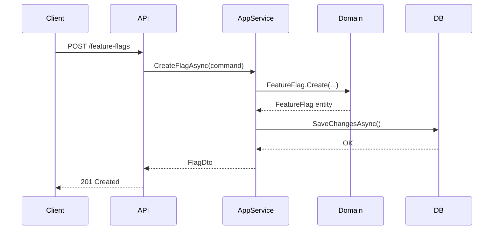
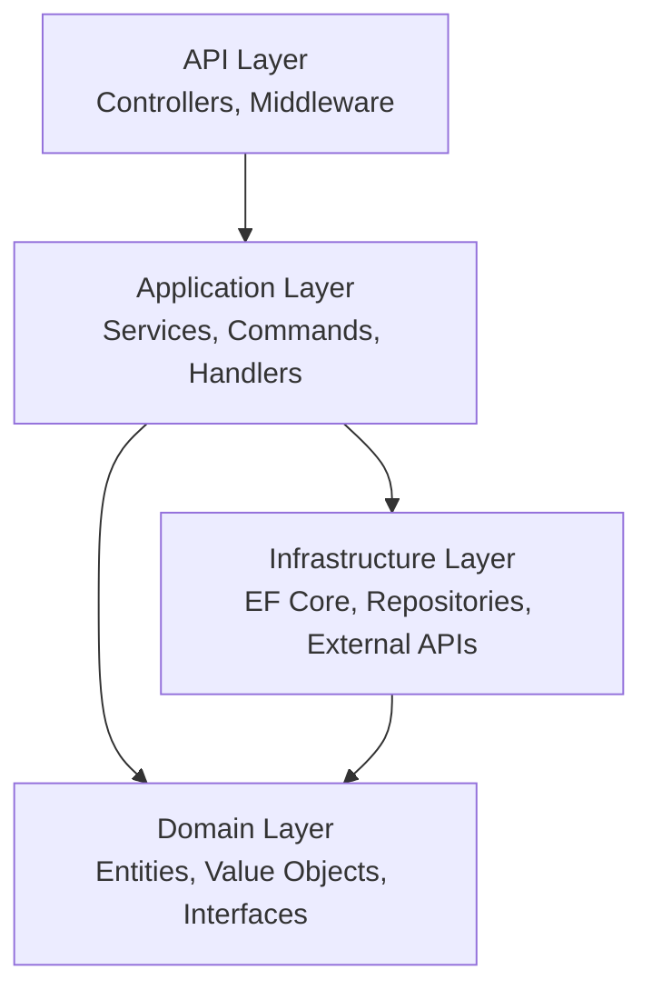
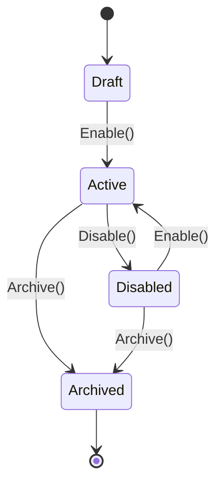
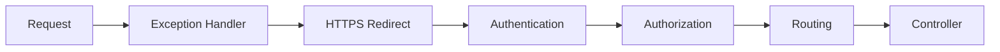

# Question Formats & Mermaid Guidance

## Question Formats

Rotate through these. Never use the same format twice in a row.

### 1. Spot the Bug / Smell
Show a code snippet (real or lightly adapted from their codebase). Ask what's wrong.
```
Here's a method from your FeatureFlagService:

[code snippet]

What's the problem here, and how would you fix it?
```
Best for: async/await, DI lifetimes, EF Core, SOLID violations.

---

### 2. Explain Your Decision
Reference an actual design choice in their code. Ask them to defend it.
```
You chose to put [X] in the [Y] layer rather than [Z].
Walk me through why. What alternative did you reject?
```
Best for: architecture, DDD, design patterns, error handling.

---

### 3. What Would Break?
Describe a change and ask them to predict the consequence.
```
If you changed X's DI lifetime from Scoped to Singleton,
what breaks at runtime and why?
```
Best for: DI lifetimes, middleware order, async, EF Core.

---

### 4. Diagram Read
Show a Mermaid diagram. Ask them to interpret it, find the gap, or name the pattern.
```
Here's a sequence diagram for your feature flag evaluation flow.
[mermaid diagram]
What's the missing error path, and where would you add it?
```
Best for: request flow, layer dependencies, domain events, aggregate lifecycle.

---

### 5. Design It
Ask them to sketch a solution to a real problem in their codebase.
```
You need to add rate limiting to this API.
Where does it go in the pipeline, and how does it interact with your existing auth middleware?
```
Best for: senior-level, architecture, API design, observability.

---

### 6. Compare & Contrast
Two approaches side by side. Which is better and why?
```
Option A: throw a DomainException from the service layer.
Option B: return a Result<T> and handle it in the controller.
Which fits this codebase better and why?
```
Best for: error handling, testing strategy, SOLID, patterns.

---

## When to Include a Mermaid Diagram

Include a diagram when the question involves:
- **Request/response flow** → sequence diagram
- **Layer dependencies** → flowchart (top-down)
- **Aggregate or domain model relationships** → flowchart or class-style graph
- **State transitions** (e.g. feature flag lifecycle) → state diagram
- **Middleware pipeline order** → flowchart (left-right)

Skip diagrams for: pure code-reading questions, single-class analysis, config questions.

---

## Mermaid Templates

### Sequence Diagram — request flow
Use for: "trace this request", "what's the missing path", middleware questions.

Prompt style: "What's missing from this flow? Where should validation happen?"

---

### Flowchart — layer dependency check
Use for: architecture questions, "what would change if", Clean Architecture probes.

Prompt style: "Arrows show dependency direction. If EF Core appears in the Domain layer, which arrow is wrong and why?"

---

### State Diagram — entity lifecycle
Use for: DDD aggregate state, feature flag enabled/disabled, order lifecycle.

Prompt style: "Is there a state transition missing here? What happens if Archive() is called on a Draft flag?"

---

### Flowchart — middleware pipeline
Use for: pipeline order questions, auth before routing, exception handler placement.

Prompt style: "If Authorization ran before Authentication in this pipeline, what would happen to a request with a valid route but no token?"
```

---

## Grading Rubric

Always apply this after each answer. Show the grade label clearly.

| Grade | Label | When to use |
|-------|-------|-------------|
| Full marks | **Nailed it** | Correct answer + correct reasoning |
| Partial | **Halfway there** | Right conclusion, shaky reasoning OR right reasoning, wrong conclusion |
| Incorrect | **Not quite** | Wrong answer — explain fully, no judgment |

After grading: always give the *ideal* answer, even for correct responses. There's always a nuance worth adding.