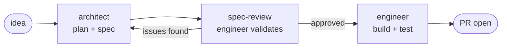

# 🌳 skill-tree-dotnet

> AI-assisted dev workflows for .NET engineers. Two agents, a toolbox of skills, and one rule that keeps the whole thing honest.

**Shout out to [Matt Pocock](https://github.com/mattpocock) — his skills repo started this.**

I got tired of explaining the same things to AI assistants over and over.
So I wrote it down once, put it in a folder, and now I just point the AI at the folder.
Turns out, that's a skill library. You're looking at mine.

If you're a .NET dev trying to get more out of AI tooling without burning a week reading docs — clone it, steal what's useful, ignore the rest.

---

## What's in here

**Two agents** that orchestrate your workflow — one thinks, one builds.
**A toolbox of skills** they pick up along the way.
**One rule** that runs everywhere: *if you can't cite it, you can't write it.*

The agents are the entry points. Everything else is a tool.

---

## How it works

The spine of the whole system — idea to PR:



The architect plans. The engineer builds. `spec-review` is the gate between them —
it catches design issues on paper, before they become bugs in code.

→ See [WORKFLOWS.md](WORKFLOWS.md) for all four workflows with full diagrams.

---

## What this is NOT

- A chatbot wrapper
- A prompt collection you paste into ChatGPT
- Generic advice that works for every stack equally
- Something that replaces thinking

It is plain text that tells an AI exactly how to help with a specific task — grounded in your actual codebase, your actual constraints, and the actual .NET ecosystem.

---

## Getting started

### 1. Reference your skills in `CLAUDE.md`

```md
## Agents

- Plan a feature: ~/dev/skill-tree/agents/architect/SKILL.md
- Implement a feature: ~/dev/skill-tree/agents/engineer/SKILL.md

## Skills

- Architecture review: ~/dev/skill-tree/architecture/improve-codebase-architecture/SKILL.md
- Design an interface: ~/dev/skill-tree/architecture/design-an-interface/SKILL.md
- TDD loop: ~/dev/skill-tree/architecture/tdd/SKILL.md
- EF Core migration: ~/dev/skill-tree/dotnet/ef-migration-plan/SKILL.md
- Quiz my codebase: ~/dev/skill-tree/learning/codebase-trivia/SKILL.md
```

### 2. Run an agent or a skill

```bash
# In Claude Code or any CLI-based AI tool
> Run the architect agent
> Run the tdd skill on this file
> Run spec-review on the current spec
```

Skills work in Claude Code, Cursor, Copilot, or any tool that reads Markdown context.
No vendor lock-in. Just plain text doing useful things.

---

## Folder structure

```
skill-tree/
├── agents/                     ← start here
│   ├── architect/              # Planning orchestrator: grill → design → spec
│   └── engineer/               # Implementation orchestrator: gate → build → PR
├── workflow/                   # Planning skills the architect chains
│   ├── write-a-design/         # L2: feature design doc with Mermaid diagrams
│   ├── write-a-spec/           # L3: behavioral spec with ACs, scope, DoD
│   ├── spec-review/            # Engineer validates spec before any code is written
│   ├── prd-to-plan/            # Breaks a spec into phased vertical slices
│   ├── prd-to-issue/           # Converts a spec into HITL/AFK GitHub issues
│   ├── request-refactor-plan/  # Plans a safe incremental refactor
│   └── write-a-skill/          # Meta-skill: scaffolds new skills
├── architecture/               # Code quality skills
│   ├── design-an-interface/
│   ├── improve-codebase-architecture/
│   ├── tdd/
│   ├── setup-pre-commit-hooks/
│   └── git-guardrails-claude-code/
├── debugging/                  # Bug triage and issue management
│   ├── triage-issue/
│   ├── qa/
│   └── github-triage/
├── dotnet/                     # .NET specialist skills
│   ├── dotnet-api-design/
│   ├── ef-migration-plan/
│   └── project-context-bootstrap/
│       └── templates/          # Foundation doc templates live here
├── learning/                   # Interview prep and design drills
│   ├── codebase-trivia/
│   ├── grill-me/
│   └── ubiquitous-language/
├── content/                    # Writing and communication
│   ├── edit-article/
│   └── linkedin-post/
├── WORKFLOWS.md                ← how the skills chain together
└── README.md
```

---

## Agents

The two entry points. Run these at the start of a session, not individual skills.

| Agent | What it does |
|---|---|
| `architect` | Planning orchestrator. Loads project context, grills you on design intent, produces an L2 design doc and L3 spec. Handles new features, spec revisions, design questions, and context refreshes. Applies the DVR rule throughout. |
| `engineer` | Implementation orchestrator. Verifies the pre-implementation gate, works the spec scope table file-by-file using TDD, produces implementation notes, updates foundation docs, and routes to the GitHub workflow. |

---

## Skill index

### 🔀 Workflow & Planning

| Skill | What it does |
|---|---|
| `write-a-design` | L2 feature design doc — Mermaid component and sequence diagrams, design decisions with tradeoffs, verified package references, explicit scope boundary. The bridge between the roadmap and the spec. |
| `write-a-spec` | L3 behavioral spec — inherits diagrams from design.md, fills in ACs, file scope table, DVR-verified technical notes, learning opportunities, DoD, and Handoff Notes for the engineer. |
| `spec-review` | Engineer's pre-implementation validation — systematic checklist across architectural integrity, AC completeness, DVR compliance, and internal consistency. Produces a structured report: Approved / Approved with Notes / Revise and Resubmit. |
| `prd-to-plan` | Breaks a spec into phased tracer-bullet vertical slices saved as a Markdown plan. |
| `prd-to-issue` | Converts a spec into independently-grabbable GitHub issues with HITL/AFK classification. |
| `request-refactor-plan` | Plans a safe incremental refactor and files it as a GitHub issue with tiny commits. |
| `write-a-skill` | The meta-skill — scaffolds new skills with proper structure and progressive disclosure. |

### 🔵 Code Quality & Architecture

| Skill | What it does |
|---|---|
| `improve-codebase-architecture` | Surfaces architectural smells and proposes deep-module refactors as GitHub RFCs. |
| `design-an-interface` | Generates multiple radically different API designs so you can pick the best one. |
| `tdd` | Red-green-refactor loop tuned for xUnit, Moq, WebApplicationFactory, and TestContainers. |
| `setup-pre-commit-hooks` | Wires up pre-commit hooks with `dotnet format`, `dotnet build`, and `dotnet test` via Husky.Net. |
| `git-guardrails-claude-code` | Blocks dangerous git and EF Core migration commands before an AI agent can run them. |

### 🟣 Debugging & Issue Management

| Skill | What it does |
|---|---|
| `triage-issue` | Investigates a bug, traces the root cause, and files a TDD-based fix plan as a GitHub issue. |
| `qa` | Interactive QA session — you describe bugs conversationally, it files clean GitHub issues. |
| `github-triage` | Manages GitHub issues through a label-based state machine with HITL/AFK classification. |

### 🟠 .NET

| Skill | What it does |
|---|---|
| `dotnet-api-design` | Audits an existing API for production readiness (5 must-haves, scored report with HITL/AFK GitHub issues per gap) or scaffolds a new one from two key architectural decisions. |
| `ef-migration-plan` | Plans, reviews, and deploys EF Core migrations safely — three gated phases, hard stops with CONFIRM keywords, zero-downtime detection, and a deployment checklist. |
| `project-context-bootstrap` | Bootstraps or refreshes a living context system (`architecture.md`, `current-state.md`, `roadmap.md`) and a thin `CLAUDE.md` router for any .NET project. Detects drift between docs and actual code. |

### 🟡 Learning & Knowledge

| Skill | What it does |
|---|---|
| `codebase-trivia` | Quizzes you on your own codebase across 14 topics with Mermaid diagrams. Senior-interview difficulty available. |
| `grill-me` | Stress-tests your design decisions one relentless question at a time. |
| `ubiquitous-language` | Extracts a DDD glossary from conversation and writes it to `UBIQUITOUS_LANGUAGE.md`. |

### ⚪ Content & Communication

| Skill | What it does |
|---|---|
| `edit-article` | Restructures and tightens prose for blog posts and technical writing. |
| `linkedin-post` | Turns a learning session or project milestone into a punchy, recruiter-friendly post in your own voice. |

---

## The DVR rule

Every skill that touches technology runs this before making a version-specific claim:

> **Doubt** — assume training data is wrong for anything version-specific.
> **Verify** — check `learn.microsoft.com` or the official package source.
> **Reference** — include the URL in the artifact. No citation, no claim.

Why this exists: AI training data goes stale fast. .NET ships annually. FluentValidation v11 → v12 removed `.Transform()`. EF Core 9 → 10 changed interceptor registration. One unverified assumption in a design doc becomes a spec defect, becomes a broken implementation, becomes two ADRs where one would have done. DVR catches it before the first line of code is written.

Pinned stack versions live in your project's `docs/ai-context.md`. Both agents read it on load.

---

## HITL / AFK

Several skills classify work as **HITL** (Human In The Loop) or **AFK** (Away From Keyboard):

- **HITL** — needs a human decision before work can proceed: architectural choices, design reviews, ambiguous requirements
- **AFK** — fully specified, an agent can implement it without waiting for input

GitHub issues created by `prd-to-issue` and `github-triage` are labeled accordingly. An agent scanning the backlog can filter `label:afk` to find tickets it can pick up autonomously.

See `debugging/github-triage/REFERENCE.md` for the one-time label setup command.

---

## Philosophy

- **Grounded in real code.** Skills read your actual codebase — not generic examples.
- **Model-agnostic.** Markdown files work everywhere: Claude Code, Cursor, Copilot, whatever ships next quarter.
- **Draft first, human approves.** Every skill that creates an artifact shows a preview before saving. Conservative by default — easy to override.
- **Cite it or drop it.** Version-specific claims without a verified source don't belong in any artifact this system produces.
- **Living document.** A new skill gets added whenever a workflow gets painful enough to warrant one.

---

## Stack context

Skills are tuned for the .NET ecosystem and pinned to:

`ASP.NET Core 10` · `EF Core 10` · `.NET 10` · `C# 14` · `xUnit` · `Moq` · `Clean Architecture` · `DDD`

---

## Contributing

Personal repo, but if a skill solves a real problem — PRs are welcome.
Keep `SKILL.md` under 100 lines. Detail and templates go in `REFERENCE.md`.
New skills go in the folder that matches their job, not the one that sounds coolest.

---

*Started in 2025. Built one painful workflow at a time.*    