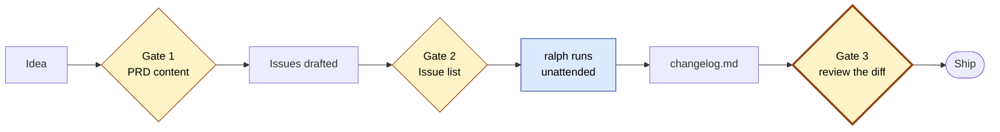

# SkillTree

> **Skills first. Agents second. Humans at the gates.**
> An agent-orchestrating OS for .NET feature delivery.

SkillTree is a workshop, not a framework. A flat directory of skills, a loop runner named ralph, and three HITL gates where you actually spend your judgment. You drive the planning. Ralph drives the building. You review the diff. Done.

No agent persona files. No four-tier document hierarchy. No spec-review of a spec that hasn't been written by anything but a model. Just: brief → tracer-bullet issues → AFK loop → review → ship.

> Originally inspired by [Matt Pocock's](https://github.com/mattpocock) skills repo. Started as a two-agent (architect / engineer) design. That design is now retired in favor of skills-first orchestration with ralph as the AFK worker.

---

## How a feature ships

Three phases — Plan, Build, Ship. Yellow diamonds are HITL gates. The blue node is the unattended AFK loop.

```mermaid
flowchart LR
    subgraph Plan["Plan — HITL"]
        direction TB
        A([idea]) --> B[/write-a-prd/]
        B --> C[(prd.md)]
        C --> D[/prd-to-issues/]
        D --> E{approve<br/>issue list?}
        E -->|revise| D
        E -->|approve| F[(issues/*.md)]
    end

    subgraph Build["Build — AFK"]
        direction TB
        G[ralph afk.sh<br/>tdd loop, sequential] --> H[(issues/done/)]
        H --> I[/wrap-up/]
        I --> J[(changelog.md)]
    end

    subgraph Ship["Ship — HITL"]
        direction TB
        K[/review<br/>criterion-anchored/] --> L{approve<br/>diff?}
        L -->|revise<br/>and re-run| G
        L -->|approve| M[git-guardrails<br/>+ push + gh pr create]
        M --> N([PR open])
    end

    F --> G
    J --> K

    style E fill:#fef3c7,stroke:#92400e,color:#000
    style L fill:#fef3c7,stroke:#92400e,color:#000
    style G fill:#dbeafe,stroke:#1e40af,color:#000
    style N fill:#d1fae5,stroke:#065f46,color:#000
```



---

## How a chore ships

Bugs, refactors, and quick wins skip the PRD step. They start as a single issue file and feed the same AFK loop.

```mermaid
flowchart TD
    A([bug or smell]) --> B[/triage-issue<br/>or improve-codebase-architecture<br/>or qa/]
    B --> C[(chores/&lt;id&gt;.md)]
    C --> D[ralph afk.sh]
    D --> E[(chores/done/)]
    E --> F[/review]
    F --> G{HITL: approve diff?}
    G -->|approve| H[push + PR]

    style G fill:#fef3c7,stroke:#92400e,color:#000
    style H fill:#d1fae5,stroke:#065f46,color:#000
```

Same loop. Smaller surface. No `wrap-up` because there's nothing to synthesize across — the chore is the slice.

---

## The three HITL gates

Time spent here is not overhead. It's where the system earns its rigor.



| # | Gate | What you're approving | Cost of skipping |

---

## The three HITL gates

Time spent here is not overhead. It's where the system earns its rigor.

| # | Gate | What you're approving | Cost of skipping |
|---|---|---|---|
| 1 | **PRD content** | The intent, success criteria, and explicit non-goals | Vague PRDs produce vague issues, which produce confused AFK runs |
| 2 | **Issue list** | The breakdown — granularity, dependencies, AFK/HITL split | Bad slices waste the loop on the wrong work |
| 3 | **`/review`** | The diff, the changelog, and foundation-doc drift | The actual quality gate — everything else is preparation |

Gates 1 and 2 are cheap (minutes). Gate 3 is the load-bearing one (proportional to the size of what shipped).

---

## Meet ralph

`ralph/afk.sh` is a loop. Each iteration:

1. read every open issue + the last few commits
2. pick the next AFK task (priority: critical bugs → infra → tracer bullets → polish → refactors)
3. run `/tdd` until the slice is green
4. run the feedback loops (`dotnet build`, `dotnet test`, `dotnet format`)
5. commit
6. move the issue to `done/`
7. repeat

When ralph runs out of AFK tasks, it emits `<promise>NO MORE TASKS</promise>` and the loop exits.

That's it. No daemon, no queue, no orchestration layer. A sandboxed Claude in a `for` loop, with sixty lines of bash to glue it together.

Ralph is sequential today. When you want parallelism, you spawn N ralphs in N git worktrees and let the filesystem be the lock. We're not there yet.

---

## What lives where

```
.
├── CLAUDE.md                       slim pointer to .claude/skills/
├── README.md                       you are here
├── .claude/
│   └── skills/                     flat directory — every skill, no subfolders
├── .agents/                        mirror of .claude/skills/ for cross-model use
├── ralph/
│   ├── afk.sh                      the loop runner
│   ├── once.sh                     single-iteration variant
│   └── prompt.md                   what ralph reads each iteration
├── docs/
│   ├── architecture.md             durable: layer rules, patterns, request flows
│   └── conventions.md              durable: pinned versions, formatting, DVR
├── features/
│   └── <slug>/
│       ├── prd.md                  the brief (8 sections)
│       ├── issues/                 tracer-bullet slices, frontmatter-tagged AFK|HITL
│       │   ├── 001-...md
│       │   └── done/
│       └── changelog.md            criterion-anchored narrative (post-AFK)
└── chores/                         single-issue work — bugs, refactors, polish
    ├── fix-email-regex.md
    └── done/
```

---

## Skill index

All skills live flat in `.claude/skills/` (mirrored to `.agents/`). The grouping below is for humans skimming this README; the filesystem is for the model.

### Pipeline — driving a feature

| Skill | Role |
|---|---|
| `grill-me` | Relentless interview pattern. Used inside `write-a-prd` and standalone for design questions. |
| `write-a-prd` | Idea → `prd.md`. Wraps the grill-me pattern with the 8-section template. |
| `prd-to-issues` | `prd.md` → tracer-bullet `issues/*.md`. Includes the HITL list-approval gate. |
| `tdd` | Red-green-refactor loop ralph runs during AFK. |
| `wrap-up` | All issues done → `changelog.md` (criterion-anchored narrative). |
| `review` | Load-bearing HITL. Diff against PRD success criteria + foundation-doc drift check. |

### Intake — getting work into the queue

| Skill | Role |
|---|---|
| `triage-issue` | Bug report → `chores/<id>.md` with TDD fix plan. |
| `qa` | Conversational QA session → multiple `chores/*.md`. |
| `improve-codebase-architecture` | Architectural smell → `chores/<id>.md` for a deep-module refactor. |

### Bootstrap — one-time project setup

| Skill | Role |
|---|---|
| `project-context-bootstrap` | Generate or refresh `architecture.md` + `conventions.md`. |
| `setup-pre-commit-hooks` | Wire Husky.Net + dotnet format/build/test on commit. |
| `git-guardrails-claude-code` | Generate the destructive-command guardrails block for `CLAUDE.md`. |

### Craft — utility skills ralph pulls during AFK

| Skill | Role |
|---|---|
| `dotnet-api-design` | Audit an existing API or scaffold a new one. |
| `ef-migration-plan` | Plan / review / deploy EF Core migrations safely. |
| `design-an-interface` | Generate competing API designs and force the tradeoff. |
| `ubiquitous-language` | Extract a DDD glossary; surface terminology drift to `/review`. |

### Learning — off-pipeline, always available

| Skill | Role |
|---|---|
| `codebase-trivia` | Quiz yourself on your own codebase. |
| `zoom-out` | Tell the agent to step up an abstraction level. |

### Content — non-code outputs

| Skill | Role |
|---|---|
| `edit-article` | Restructure and tighten article drafts. |
| `linkedin-post` | Turn a learning, ship, or opinion into a punchy post. |

### Meta

| Skill | Role |
|---|---|
| `write-a-skill` | Author new skills with the right structure and progressive disclosure. |

---

## Quickstart — I am here, what do I run?

| Situation | Run |
|---|---|
| Brand new project, no docs | `project-context-bootstrap` → `setup-pre-commit-hooks` → `git-guardrails-claude-code` |
| Have an idea, want to spec it | `write-a-prd` |
| `prd.md` is locked, ready to slice | `prd-to-issues` |
| Issue list is approved | `ralph/afk.sh <iterations>` |
| All issues done | `wrap-up` then `/review` |
| Found a bug | `triage-issue` (drops a chore in `chores/`) |
| Spotted an architectural smell | `improve-codebase-architecture` |
| Doing exploratory testing | `qa` |
| Diff is in front of you, ready to ship | `/review` |
| Don't know your way around a module | `zoom-out` |
| Want to test what you actually understand | `codebase-trivia` |

---

## Foundation docs

Two docs. Both durable. Both maintained by `project-context-bootstrap` (initial generation) and `/review` (drift detection on every PR).

**`docs/architecture.md`** — the *shape* of the system. Layer rules, dependency directions, request flows, key patterns. Updated when a *durable* new pattern lands. Not when one feature uses an existing pattern.

**`docs/conventions.md`** — the *rules*. Pinned versions, formatting, DVR ("Doubt, Verify, Reference" — verify any tech claim against the pinned stack). Updated when a convention or pinned version actually changes.

If a skill needs more context than these two docs provide, the answer is to **read the code** — not to add a third doc. The active queue (`features/`, `chores/`) is the system's working state. We are not adding `current-state.md`. Or `roadmap.md`. Or `status.md`.

---

## Why this exists

Most "AI workflow" repos are either (a) a CLAUDE.md and vibes, or (b) a five-tier ceremony where the model writes a PRD, a design doc, a spec, a spec-review of the spec, and an implementation plan, and *then* writes twelve lines of code that fail their own tests.

SkillTree is the middle path. Skills are small. Artifacts earn their weight. The loop runs unattended when work is well-defined; humans gate where judgment matters. Three gates, not seven.

It's also explicitly model-agnostic at the skill layer — `.claude/skills/` is for Claude Code, `.agents/` is the same content for everything else.

---

## Status

Currently rebuilding from a previous architect / engineer two-agent design. The skills listed in this README were originally scattered across "Workflow & Planning," ".NET," "Code Quality & Architecture," and friends — they're being flattened, mutated, or retired during the migration.

If a skill is referenced here but missing from the filesystem, it's mid-migration. Open a chore.
