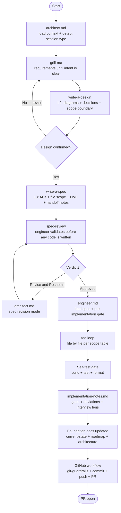
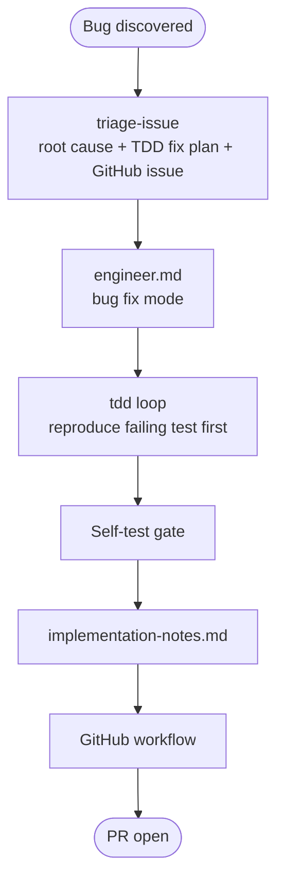
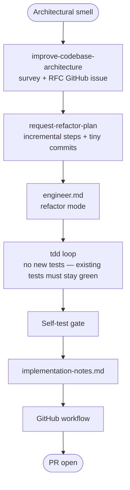
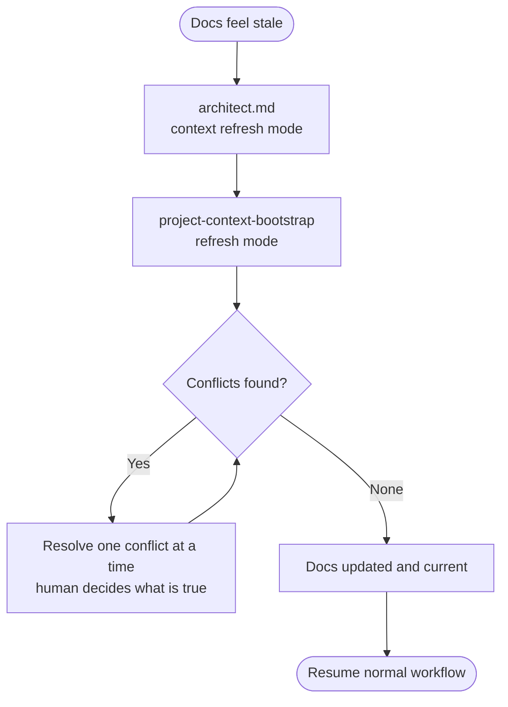

# Workflows

> How the skills chain together. Read this before running any agent.
> For skill details, read the individual `SKILL.md` files.
> For project conventions and guardrails, read `docs/ai-context.md`.

---

## The core idea

Two agents. One cycle.

```
architect  →  spec-review  →  engineer  →  PR
```

The **architect** plans. The **engineer** builds. `spec-review` is the gate
between them — it catches design issues before they become code issues.

Everything else in the skill tree is a tool one of them picks up along the way.

---

## The four workflows

### 1. New feature

The main workflow. Runs for every planned feature on the roadmap.



**Artifacts produced:**

| Artifact | Path | Produced by |
|---|---|---|
| Design doc | `docs/decisions/<branch>/design.md` | `write-a-design` |
| Spec | `docs/decisions/<branch>/spec.md` | `write-a-spec` |
| Spec review report | `docs/decisions/<branch>/spec-review.md` | `spec-review` |
| Implementation notes | `docs/decisions/<branch>/implementation-notes.md` | `engineer.md` |

---

### 2. Bug fix

Starts with triage, ends with a PR. No planning session required.



**Key difference from new feature:** no architect session, no design doc, no spec.
The triage-issue output *is* the plan. The engineer reads it and implements directly.

---

### 3. Refactor

Starts with an architectural smell. No new behavior — tests prove the contract
is unchanged.



**Key difference from new feature:** no new ACs. The refactor is complete when
all existing tests pass and the code is cleaner. Any new behavior discovered
during refactor becomes a separate feature workflow.

---

### 4. Context refresh

Runs when foundation docs feel stale, after a phase completes, or before
starting a new planning session on a project you haven't touched in a while.



**When to run this:** at the start of any session where more than two weeks
have passed, after merging a large PR, or whenever you notice the AI making
suggestions that contradict the codebase.

---

## Artifact map

Where everything lives relative to the repo root:

```
docs/
  ai-context.md               ← always loaded first by both agents
  architecture.md             ← system design, layer rules, ADR index
  current-state.md            ← phase status, what's built, known issues
  roadmap.md                  ← phase map, current focus
  decisions/
    adr/
      adr-<name>-v1.md        ← architecture decision records (append-only)
      adr-<name>-v1.1.md      ← superseding ADR if v1 was revised
    <feature-branch-name>/
      design.md               ← L2: architect produces, engineer reviews
      spec.md                 ← L3: architect produces, engineer approves
      spec-review.md          ← engineer's pre-implementation report
      implementation-notes.md ← engineer's post-implementation record

developer-context.md          ← personal AI config (gitignored, never committed)
CLAUDE.md                     ← AI router: quick context + doc pointers + skills
```

---

## DVR — the rule that runs everywhere

> **Doubt, Verify, Reference.**
> Any version-specific technology claim must be verified against the pinned
> stack versions in `docs/ai-context.md` before it appears in any artifact.
> No citation = no claim.

This rule is not workflow-specific. It applies in every architect session,
every engineer session, and every spec-review. Both agents enforce it.
The pinned versions live in `docs/ai-context.md`.

---

## HITL / AFK classification

GitHub issues produced by this workflow are labeled:

- **`hitl`** — Human In The Loop. Requires a decision before work can proceed.
  Examples: architectural choices, design reviews, ambiguous requirements.
- **`afk`** — Away From Keyboard. Fully specified. An agent can pick it up
  without waiting for human input.

An agent scanning the backlog can filter `label:afk` to find tickets it can
implement autonomously. See `debugging/github-triage/REFERENCE.md` for the
one-time label setup.

---

## Quick reference

> I am here. What do I run?

| Situation | Run |
|---|---|
| Starting a new feature | `architect.md` |
| Design intent is unclear, need to think it through | `architect.md` → `grill-me` |
| Design is clear, need an L2 doc with diagrams | `write-a-design` |
| Design doc is done, need the detailed spec | `write-a-spec` |
| Spec is written, need engineer validation before coding | `spec-review` |
| Spec is approved, ready to implement | `engineer.md` |
| Spec-review returned blocking issues | `architect.md` (revision mode) |
| In the middle of implementation, resuming | `engineer.md` (resume mode) |
| Found a bug, need to triage and plan the fix | `triage-issue` |
| Have a bug fix plan, ready to implement | `engineer.md` (bug fix mode) |
| Spotted an architectural smell | `improve-codebase-architecture` |
| Have a refactor plan, ready to implement | `engineer.md` (refactor mode) |
| Docs feel stale before a planning session | `architect.md` (context refresh) |
| Need a new API endpoint designed properly | `dotnet-api-design` |
| Making a database schema change | `ef-migration-plan` |
| Setting up a new project from scratch | `project-context-bootstrap` |
| Something went wrong with a git command | `git-guardrails-claude-code` |

---

## Session continuity

Both agents produce a **session summary** at the end of every session.
Paste it into the next session to restore context without re-reading every document.

Format (three sentences):

```
What was decided/built: [the key artifact or decision from this session]
Where we left off: [exact next step — which skill to run, which document to read]
Open items: [unresolved questions, [VERIFY] flags, deferred items — or "None"]
```

The architect's closing summary is the engineer's opening context.
The engineer's closing summary is the next architect session's opening context.