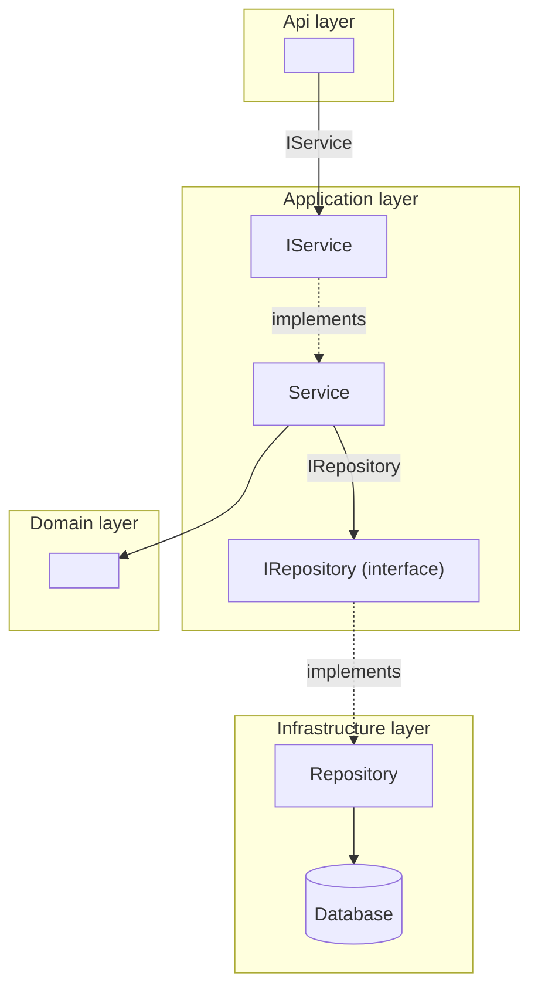
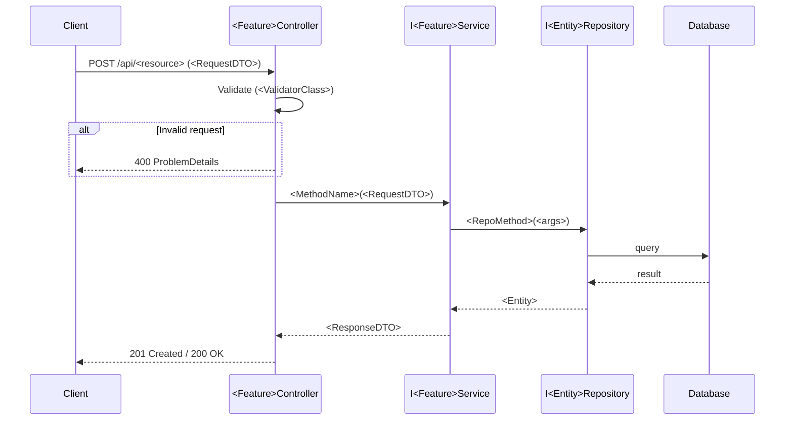

# write-a-design — Reference

## When to use which diagram

| Situation | Diagram | Why |
|---|---|---|
| New component added to any layer | Component | Catches layer violations immediately |
| New request path through the system | Sequence | Shows timing, interface crossings, error paths |
| Pure domain model change (no new request path) | Component only | Sequence adds no information |
| Cache, decorator, or strategy pattern | Both | Component shows placement, sequence shows substitution |
| Cross-cutting concern (middleware, filter) | Sequence | Shows where in the pipeline it intercepts |

Default: always produce the component diagram. Add the sequence diagram when
a new request path exists.

---

## Component diagram template



Annotation guide:
- Solid arrow `-->` = depends on / calls
- Dashed arrow `-.->` = implements
- Label the solid arrows with the interface name
- New components: add a `:::new` class and a legend entry
- Modified components: add a `:::modified` class and a legend entry

```mermaid
classDef new fill:#E1F5EE,stroke:#1D9E75
classDef modified fill:#FAEEDA,stroke:#EF9F27
```

---

## Sequence diagram template



Keep sequence diagrams to the happy path plus one error path.
Additional error paths belong in the spec's acceptance criteria, not the design doc.

---

## Decision record format

```md
### Why <approach A> instead of <approach B>?

**Decision:** <one sentence — what was decided>

**Rationale:** <why this approach fits the system as designed>

**Alternative considered:** <approach B — describe it concisely>

**Why rejected:** <what it would cost or break>

**Reference:** [<source title>](<url>) — verified against .NET <version>
```

The reference line is required for any decision involving a package, API, or
language feature. If verification was not possible: mark `[VERIFY — human review required]`.

---

## DVR quick reference

| Step | Action |
|---|---|
| **D**oubt | Assume training knowledge is wrong for version-specific claims |
| **V**erify | Check learn.microsoft.com or the official package source |
| **R**eference | Include the URL in the artifact — no citation, no claim |

Sources in priority order:
1. `learn.microsoft.com` — .NET, C#, ASP.NET Core, EF Core
2. `fluentvalidation.net/docs` — FluentValidation
3. `nuget.org/packages/<package>` — version confirmation for any NuGet package
4. `github.com/<owner>/<repo>` — changelog and release notes for breaking changes

If a claim cannot be verified from one of these sources, it does not belong
in the design document without a `[VERIFY]` flag.

---

## Layer boundary cheat sheet

```
Api             → Application  (via I<Feature>Service)
Application     → Domain       (entities, value objects, domain interfaces)
Infrastructure  → Domain       (implements repository interfaces)
Domain          → (nothing)
```

A new component that draws a dependency arrow pointing *outward* from Domain,
or *inward* to Infrastructure from Application, is a layer violation.
Stop and surface it — do not design around it.